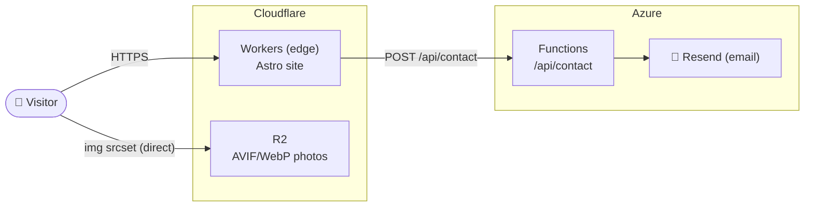

# shiqihu.com — Personal Portfolio

The code behind my corner of the internet — engineering work I'm proud of, photos I've taken, and a form you can use to reach me.

Built for speed: fully static HTML/CSS at load time, with JavaScript only where interaction is needed — powered by Astro and React islands, deployed on Cloudflare Workers with a serverless contact API and a Cloudflare R2 image pipeline.

## [→ Visit shiqihu.com](https://shiqihu.com)

## Table of contents

- [Tech stack](#tech-stack)
- [Key tradeoffs](#key-tradeoffs)
- [Architecture](#architecture)
- [Notable implementation details](#notable-implementation-details)
- [Project structure](#project-structure)
- [Local development](#local-development)
- [Editing content](#editing-content)
- [Configuration](#configuration)
- [License](#license)

## Tech stack

| Layer | Technology | Why |
| --- | --- | --- |
| Framework | **Astro 7** | Static-first, ships zero JavaScript by default; fast loads and strong SEO out of the box. |
| Interactivity | **React 19 islands** | Interactive pieces (theme toggle, gallery lightbox, contact form) hydrate independently — JS is scoped to where it's needed. |
| Language | **TypeScript (strict)** | End-to-end type safety across UI, data, and the serverless API. |
| Styling | **Tailwind CSS v4** | Utility-first styling with a single design-token source of truth (CSS variables) driving light/dark themes. |
| Animation | **Motion** | Subtle, accessible entrance and hover motion; respects `prefers-reduced-motion`. |
| Icons | **lucide-react** | Tree-shakeable SVG icon set. |
| Hosting & CI/CD | **Cloudflare Workers** | Global edge network, free SSL, deployed via `wrangler deploy` in GitHub Actions. |
| API | **Azure Functions (Node 20, TS)** | The `/api/contact` endpoint validates input, applies a honeypot + rate limit, and sends email. |
| Media | **Cloudflare R2** | S3-compatible object storage serving a responsive AVIF/WebP image pipeline for the photography gallery. |

## Key tradeoffs

**Astro over a React-based meta-framework (Next.js / Remix)**

A portfolio is almost entirely static content — the trade-off is straightforward. Next.js ships a JS runtime and hydrates the full page by default; every visitor pays that cost even when they're just reading text. Astro flips the default: pages are pure HTML/CSS, and JavaScript is opt-in per component via islands. The result is a significantly smaller JS bundle and faster Time to Interactive, with no meaningful loss of capability for this use case. React is still used where it earns its keep — the theme toggle, gallery lightbox, and contact form — but it doesn't come along for the ride everywhere else.

## Architecture



- **Cloudflare Workers** serves the Astro-built site at the edge (`wrangler deploy`).
- **Cloudflare R2** hosts responsive AVIF/WebP photo variants; the browser fetches them directly via `` — no runtime image processing.
- **Azure Functions** is a separate deployment (`api/`) that handles contact form submissions, validates input, and sends email via Resend.

## Project structure

```
src/
  components/   UI components (Astro) + React islands (.tsx)
  sections/     Page sections (Hero, About, Experience, Projects, Skills, Photography, Contact)
  layouts/      BaseLayout.astro (meta / OG / SEO, no-flash theme)
  data/         Content as typed data (profile, experience, projects, skills, photos)
  lib/          Helpers (responsive-image srcset, nav config)
  styles/       globals.css (Tailwind + design tokens)
  pages/        index.astro, 404.astro
api/            Azure Functions (contact endpoint)
scripts/        optimize-and-upload-photos.ts (sharp → AVIF/WebP → R2)
```

## Local deployment instruction

```bash
npm install
npm run dev        # start the dev server
```
Then open the website at your localhost.

## Editing content

Content lives as typed data in `src/data/` — no component edits needed for routine updates.

- **Profile / tagline / socials:** `src/data/profile.ts`
- **Experience:** `src/data/experience.ts`
- **Projects:** `src/data/projects.ts`
- **Skills:** `src/data/skills.ts`
- **Résumé:** set the `PUBLIC_RESUME_URL` environment variable to the PDF URL (e.g. a Cloudflare R2 public URL); the "Résumé" buttons link to it automatically.
- **Photography:**
  1. Create a local `photos/` folder (git-ignored, not in the repo) and put your web-sized source images in it.
  2. Run `npm run photos` to generate AVIF/WebP variants and upload them to Cloudflare R2.
  3. Add an entry (base URL, dimensions, alt, caption) to `src/data/photos.ts`.

## Configuration

Runtime configuration is provided through environment variables (see `.env.example` for the variable names). Values are supplied via local `.env` for scripts; in production, Cloudflare Workers secrets are set via `wrangler secret put` and Azure Functions settings are configured in the Azure portal.

## License

See [LICENSE](LICENSE).
